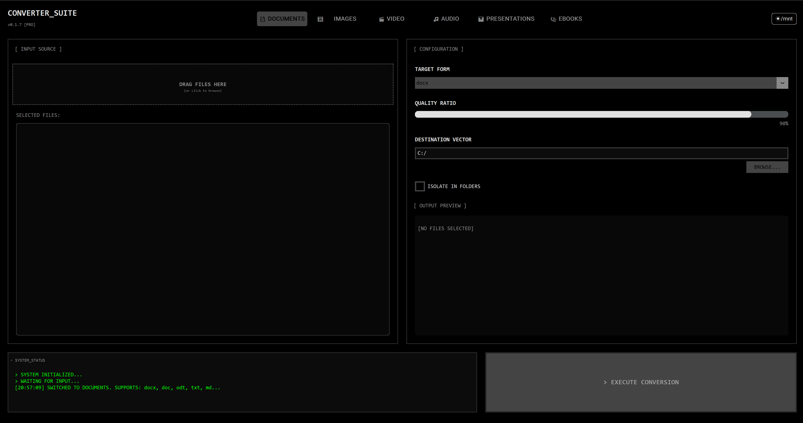
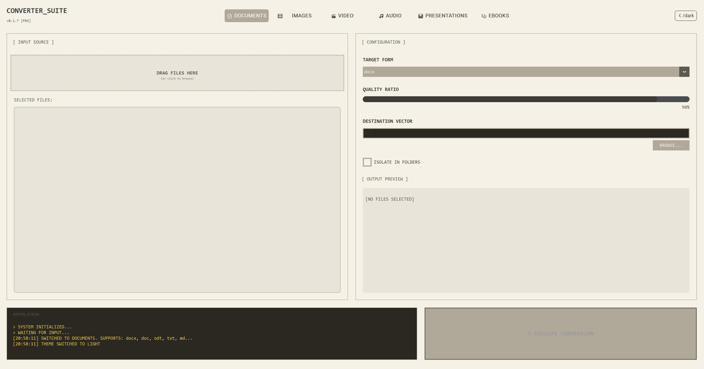

# Converter Suite Pro

**Version:** 0.1.4  
**Developer:** graeLabs

Universal file converter supporting documents, images, video, audio, eBooks, and presentations with a modern, tech-focused interface.

````carousel

<!-- slide -->

````

## Features

- **Cross-Platform**: Runs on Windows, macOS, and Linux.
- **Improved UI**: Modern interface with full Dark Mode and Light Mode support.
- **100+ Format Conversions**:
    - **Documents**: DOCX, PDF, TXT, MD, HTML, RTF, ODT, EPUB, TEX, RST, ORG
    - **Images**: PNG, JPG, WebP, BMP, GIF, TIFF, ICO
    - **Video**: MP4, MKV, AVI, MOV, WebM, FLV, WMV, M4V, 3GP
    - **Audio**: MP3, WAV, FLAC, OGG, M4A, AAC, OPUS, WMA (extraction from video included)
    - **eBooks**: EPUB, DOCX, ODT, TXT, MD, HTML, RTF, TEX -> EPUB, PDF, DOCX, TXT, HTML, MD
    - **Presentations**: PPTX, PPT, ODP, PPSX, PPS -> PDF, PNG, JPG, ODP, PPTX
- **Modular Architecture**: Backend support for industry-standard tools (FFmpeg, LibreOffice, Pandoc).
- **Drag & Drop**: Easy batch processing with drag-and-drop support.

## Installation

1. **Clone the repository:**
   ```bash
   git clone https://github.com/graeLabs/converter-suite.git
   cd converter-suite
   ```

2. **Install Python dependencies:**
   ```bash
   pip install -r requirements.txt
   ```

3. **External Dependencies:**
   For full functionality, ensure the following are installed (or placed in a `./deps` folder):
   - **FFmpeg**: Required for Video/Audio conversion.
   - **LibreOffice**: Required for Presentation/Document conversion.
   - **Pandoc**: Required for advanced Document/eBook formats.

## Usage

Run the application:
```bash
python main.py
```

## Supported Conversions

| Category | Input Formats | Export Formats | Backend |
|----------|---------------|----------------|---------|
| **Documents** | DOCX, DOC, ODT, TXT, MD, HTML, RTF, EPUB, TEX, RST | PDF, DOCX, ODT, MD, HTML, TXT, RTF, EPUB, TEX | Pandoc / LibreOffice |
| **Images** | PNG, JPG, BMP, WebP, TIFF, ICO, GIF | PNG, JPG, WebP, GIF, TIFF, ICO | Pillow |
| **Video** | MP4, MKV, AVI, MOV, WebM, FLV, WMV, M4V, 3GP | MP4, WebM, MKV, AVI, MOV, GIF | FFmpeg |
| **Audio** | MP3, WAV, FLAC, OGG, M4A, AAC, OPUS, WMA | MP3, WAV, FLAC, OGG, M4A, AAC, OPUS | FFmpeg |
| **eBooks** | EPUB, DOCX, ODT, TXT, MD, HTML, RTF, TEX | EPUB, PDF, DOCX, TXT, HTML, MD | Pandoc |
| **Presentations** | PPTX, PPT, ODP, PPSX, PPS | PDF, PNG, JPG, ODP, PPTX | PowerPoint / LibreOffice |

## License

MIT License - Copyright © 2026 graeLabs
